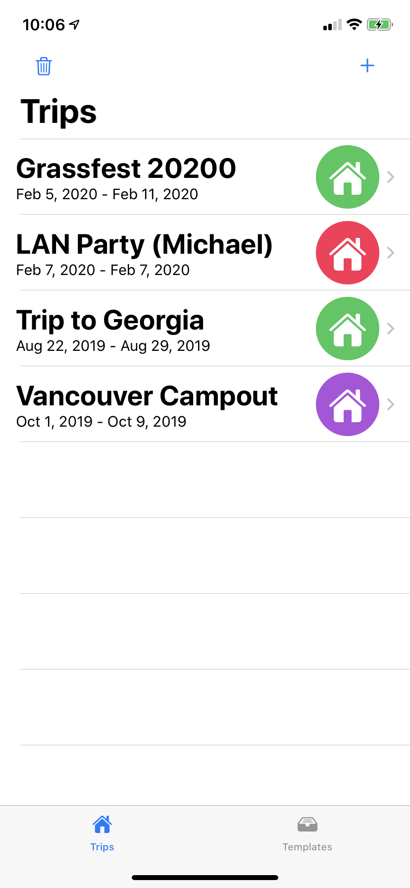
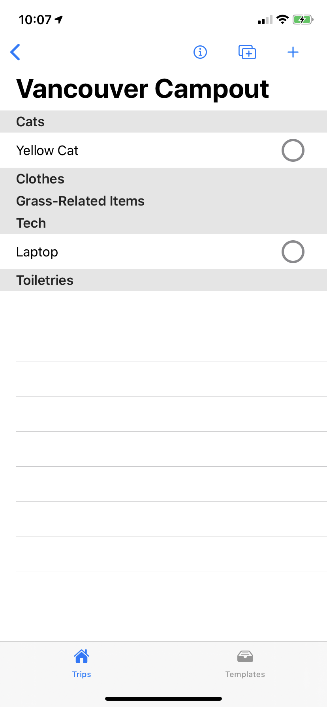

#  Untitled Packing List App
This project is an (incomplete) packing list app built with SwiftUI and Core Data. 

Currently, this project is very much a work in progress, but I'm using it as a way to experiment with and learn SwiftUI

# Installation
 
 To build and run the app, the following requirements are needed
  *  [Xcode 11](https://developer.apple.com/xcode/)

Then, clone the repo, (easiest way is via the [Open In Xcode button on Github](https://github.blog/2017-06-05-clone-in-xcode/))

You should be able to build and run the usual way after that.

# App
Currently, the app's functionality is quite limited, but it does have basic list features like 
* Adding things to a list
* Deleting things to a list
* Usually not crashing
* Saving with Core Data
* Creating templates of items
* And more misc things

# Contributing
So, this is mostly a self-worked project, but if you have anything to contribute, please feel free to submit a PR or filing an issue.

And if any bugs or issues do come up, you can alert me by [filing an issue](https://github.com/katzrkool/trips/issues/new), but as my time is limited, and this project is constantly changing (not much stability yet), I can't promise immediate resolution.

# Future
I hope to have this app become a fully featured packing list app with native tie-ins like Shortcuts support and other features.

Eventually, I'd like to have this be submitted in the app store, but regardless,  it's been a great learning opportunity, and I hope my work can help others with (poorly documented) SwiftUI, especially w/ Core Data connections. 
